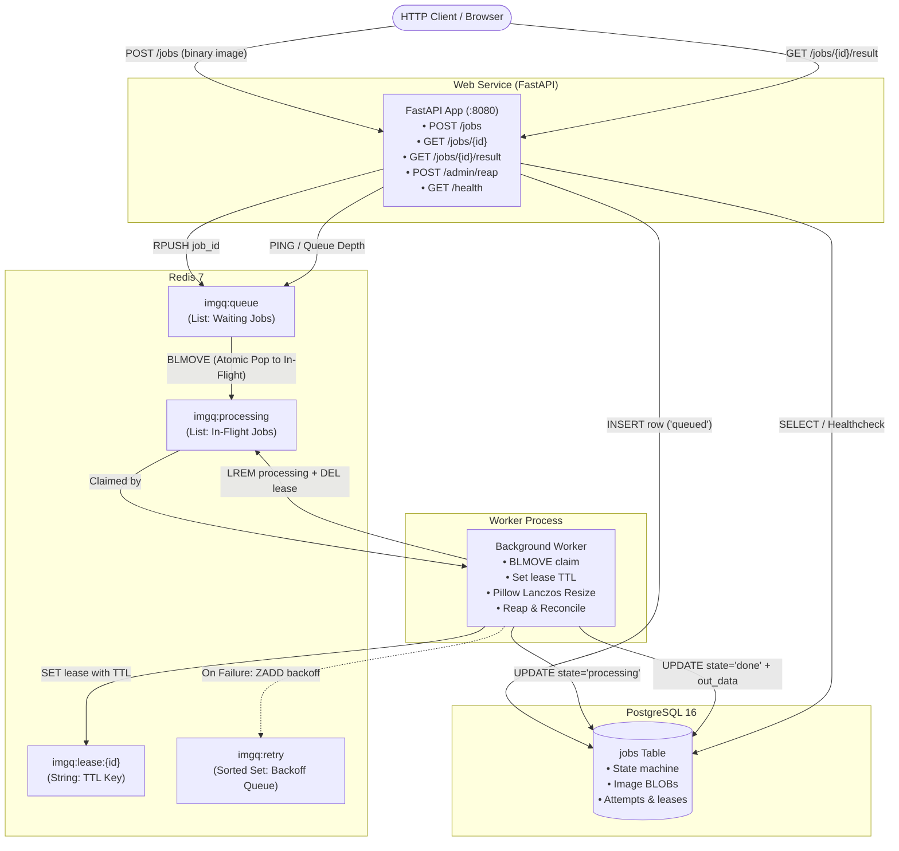

# Image Processing Queue

**Language:** Python 3.12 (FastAPI) &nbsp;|&nbsp; **Storage & Broker:** PostgreSQL 16 + Redis 7

A production-grade, distributed asynchronous image resizing pipeline built with FastAPI, a standalone background worker, PostgreSQL for durable job persistence, and Redis for crash-resilient queue management.

---

## Architecture Diagram



### Components
1. **`web` (FastAPI)**: Serves the REST API on port `8080`. Accepts binary image uploads, creates job records in Postgres, enqueues jobs to Redis, serves status and results, and exposes healthcheck and reap administration endpoints.
2. **`worker` (Python 3.12)**: Consumes jobs using atomic `BLMOVE` from `imgq:queue` to `imgq:processing`, takes an expiring lease key, performs high-quality Lanczos resizing in Pillow, and writes output PNGs back to PostgreSQL.
3. **`postgres` (PostgreSQL 16)**: Source of truth storing image data (`BYTEA`), requested bounding boxes, state transitions, attempts, and error logs.
4. **`redis` (Redis 7)**: Broker managing the ready queue (`imgq:queue`), in-flight list (`imgq:processing`), lease expiration keys (`imgq:lease:{id}`), and scheduled backoff retries (`imgq:retry`).
5. **`migrate`**: One-shot init container running schema and seed migrations before application containers boot.

---

## Quickstart

### Prerequisites
- Docker Engine 20.10+ / Docker Desktop
- Docker Compose v2+

### 1. Launch the Stack
Copy the environment variables template and launch the containers:

```bash
cp .env.example .env
docker compose up --build -d
```

### 2. Verify Health
Verify both Postgres and Redis are healthy:

```bash
curl -s http://localhost:8080/health
```

Expected response:
```json
{"status":"ok","postgres":true,"redis":true}
```

### 3. Submit an Image and Retrieve the Result

Submit a binary image to resize to fit within a 200x200 box:
```bash
curl -s -X POST --data-binary @photo.png -H "Content-Type: image/png" \
  "http://localhost:8080/jobs?width=200&height=200&filename=photo.png"
```

Response:
```json
{"job_id":6,"state":"queued","poll":"/jobs/6","size_bytes":1066,"box":{"width":200,"height":200}}
```

Poll the status:
```bash
curl -s http://localhost:8080/jobs/6
```

Download the resized PNG:
```bash
curl -s http://localhost:8080/jobs/6/result -o thumbnail.png
```

---

## How to Run Tests

Ensure you have a Python 3.12 virtual environment with test dependencies installed:
```bash
python -m venv .venv
source .venv/bin/activate  # On Windows: .venv\Scripts\Activate.ps1
pip install -r requirements-dev.txt
```

### Unit Tests (Pure Logic, No DB/Network)
Tests all state machine transitions, backoff calculation, lease expiration arithmetic, image target bounding box logic, upload validations, and worker logic using mocks.

```bash
pytest tests/unit --cov=app --cov-report=term-missing --cov-fail-under=70
```

Coverage Report Output:
```
Name              Stmts   Miss  Cover   Missing
-----------------------------------------------
app/__init__.py       0      0   100%
app/cache.py         20     11    45%   12-14, 18-19, 23, 27-28, 32-34
app/db.py            16      9    44%   9, 13, 17-21, 25-26
app/jobs.py          88      0   100%
app/main.py         123     12    90%   90, 109, 118, 122, 163-166, 171, 176, 180, 187, 199
app/queue.py         32      0   100%
app/worker.py       121     31    74%   67-68, 70, 76, 78, 87-88, 137, 164-185, 189
-----------------------------------------------
TOTAL               400     63    84%
Required test coverage of 70% reached. Total coverage: 84.25%
```

### Integration Tests (Real Postgres + Redis)
Integration tests run against live Postgres and Redis databases, testing migrations, Redis queue operations, endpoint responses, reaper reclaiming expired leases, and end-to-end image processing with a worker subprocess:

```bash
# Ensure compose postgres and redis are running
docker compose up -d postgres redis

# Run integration tests
pytest tests/integration -m integration -v
```

---

## CI/CD Overview

The pipeline is implemented in `.circleci/config.yml` with strict dependency ordering:

```
lint ──► unit-tests ──► integration-tests ──► secret-scan ──► build-image
```

1. **`lint`**:
   - Executes `ruff check .` for PEP8 compliance, bug detection, and style.
   - Executes `hadolint Dockerfile` for container best practices (pinned digest, non-root user, clean layer caching).
2. **`unit-tests`**:
   - Runs `pytest tests/unit` with coverage tracking against `app`.
   - Enforces coverage threshold `>= 70%`.
   - Stores JUnit XML test results and HTML/XML coverage artifacts.
3. **`integration-tests`**:
   - Primary `cimg/python:3.12.8` executor with `cimg/postgres:16.8` and `cimg/redis:7.2.7` service containers accessible on `localhost`.
   - Installs `postgresql-client`, waits for database readiness, applies `migrations/*.sql` in filename order, and executes `@pytest.mark.integration` test suite.
4. **`secret-scan`**:
   - Executes `zricethezav/gitleaks:v8.24.0` across the full git commit history to detect leaked credentials, tokens, or private keys.
5. **`build-image`**:
   - Uses `setup_remote_docker` to build `imgq:1.0`.
   - Smoke tests the container: verifies it runs in detached mode, confirms the execution UID is non-root (`UID=999`).
   - Tag-gated push to Docker Hub using context credentials (`DOCKERHUB_USERNAME`, `DOCKERHUB_TOKEN`).

### Manual Docker Hub Push Commands
To push the image to your Docker Hub repository:
```bash
docker login
docker tag imgq:1.0 <your-dockerhub-username>/imgq:1.0
docker push <your-dockerhub-username>/imgq:1.0
```

---

## Crash Recovery Proof

This test demonstrates that when a worker is abruptly killed with `SIGKILL` while holding an active job, the job is never lost. The job remains durable in Redis, its lease TTL expires safely, and the reaper puts it back onto the queue with an incremented attempt count.

### Step-by-Step Live Execution & Captured Output

#### 1. Set `SLOW_MS=30000` on the worker and submit a job
Start the worker with a deliberate delay to simulate a long-running resize:
```bash
$res = curl.exe -s -X POST --data-binary "@demo.png" -H "Content-Type: image/png" \
  "http://localhost:8080/jobs?width=200&height=200&filename=crash-demo.png"
Write-Output $res
```

**Real Captured Output:**
```json
{"job_id":8,"state":"queued","poll":"/jobs/8","size_bytes":913,"box":{"width":200,"height":200}}
```

#### 2. Kill the worker mid-flight with SIGKILL
While the worker is processing job 8, kill it immediately:
```bash
docker compose kill -s KILL worker
```

**Real Captured Output:**
```
 Container image-queue-python-worker-1 Killing 
 Container image-queue-python-worker-1 Killed 
```

#### 3. Confirm job remains in `imgq:processing` and lease TTL is active
Inspect Redis immediately after the worker process terminates:
```bash
docker compose exec redis redis-cli LRANGE imgq:processing 0 -1
docker compose exec redis redis-cli TTL imgq:lease:8
docker compose exec redis redis-cli EXISTS imgq:lease:8
```

**Real Captured Output:**
```
8
26
1
```
*(The job ID `8` is preserved in `imgq:processing`, and the lease TTL has 26 seconds remaining).*

#### 4. Observe the lease expire
Wait 27 seconds for the 30-second lease to expire:
```bash
docker compose exec redis redis-cli TTL imgq:lease:8
docker compose exec redis redis-cli EXISTS imgq:lease:8
```

**Real Captured Output:**
```
-2
0
```
*(`-2` indicates key expired and does not exist).*

#### 5. Trigger the Reaper (`POST /admin/reap`)
Invoke the reaper endpoint to reclaim unacknowledged jobs with expired leases:
```bash
curl.exe -s -X POST http://localhost:8080/admin/reap
```

**Real Captured Output:**
```json
{
  "checked_in_flight": 1,
  "actions": [
    {
      "job_id": 8,
      "action": "requeue",
      "reason": "lease expired",
      "attempts": 1
    }
  ],
  "lease_seconds": 30.0
}
```

#### 6. Verify job is back in `imgq:queue` and state updated in database
Inspect Redis queue and Postgres job status:
```bash
docker compose exec redis redis-cli LRANGE imgq:queue 0 -1
docker compose exec redis redis-cli LRANGE imgq:processing 0 -1
curl.exe -s http://localhost:8080/jobs/8
```

**Real Captured Output:**
```
8

{
  "job_id": 8,
  "state": "queued",
  "progress": 0,
  "attempts": 1,
  "max_attempts": 3,
  "filename": "crash-demo.png",
  "size_bytes": 913,
  "source": {"width": null, "height": null},
  "requested_box": {"width": 200, "height": 200},
  "result": null,
  "result_available": false,
  "last_error": "worker died holding this job",
  "created_at": "2026-10-08T17:26:41.110620+00:00",
  "updated_at": "2026-10-08T17:27:28.631265+00:00"
}
```
*(`imgq:queue` contains `8`, `imgq:processing` is empty, attempts is incremented from `0` to `1`, and `last_error` documents `worker died holding this job`).*

When the worker container is restarted, it consumes job 8 and finishes it cleanly:
```json
{"job_id":8,"state":"done","progress":100,"attempts":1,"max_attempts":3,"result_available":true}
```

---

## Design Explanation

### a. Why BLMOVE rather than LPOP
**The Problem with LPOP:**
When a worker calls `LPOP imgq:queue`, Redis immediately removes the job ID from the list and returns it over the network socket. Between the microsecond Redis removes the element and the moment the worker successfully records the job in a durable store (Postgres or an in-flight key), the job ID exists solely inside the worker process's volatile heap memory.

**How wide is that window?**
This window spans:
1. TCP packet transit from Redis to worker (network partitions, dropped connections, RST packets).
2. Socket buffer read into Python runtime.
3. Process-level failures: uncatchable `SIGKILL` (e.g. host shutdown, Kubernetes eviction), Linux kernel Out-Of-Memory (OOM) killer terminating the worker, hardware crash, or unhandled exceptions before taking the lease.

If any failure occurs during that gap, the job is permanently lost without trace.

**How BLMOVE closes it:**
`BLMOVE imgq:queue imgq:processing timeout LEFT RIGHT` executes as a single, atomic operation inside Redis's single-threaded event loop. There is literally no point in time where the job ID is not stored inside Redis: it is removed from the waiting queue and appended to the in-flight list atomically. If the worker crashes immediately after BLMOVE or during network transit, the job remains safely recorded in `imgq:processing`.

---

### b. Why a lease with a TTL instead of the worker promising to clean up
**Dead Workers Can't Clean Up:**
A dead process cannot execute cleanup code. While graceful shutdown hooks (`try/finally`, signal handlers for `SIGINT` or `SIGTERM`) can catch normal exits, they offer zero protection against `SIGKILL`, abrupt host reboots, power cuts, hard VM freezes, or kernel kernel panics. Relying on the worker to clean up its own state assumes the worker is alive—a contradiction during a crash.

**TTL Expiry is an Autonomous Failure Detector:**
A key with an expiration TTL (`SET imgq:lease:{id} 1 EX 30`) is managed entirely by Redis's timer system. If a worker dies, the Redis clock continues ticking independently of the worker's fate. TTL expiry requires zero cooperation or action from the failed process. Furthermore, a lease TTL cleanly differentiates between a **slow** worker (which can renew its lease while making progress) and a **dead** worker (which stops renewing, allowing the lease to lapse).

---

### c. Why attempts must increment on reclaim
If the attempt counter were not incremented during a reclaim, any **poison-pill job** (for example, a maliciously crafted PNG that triggers an unhandled memory bug, segmentation fault, or instant OOM crash in the C graphics library) would:
1. Be picked up by Worker A.
2. Crash Worker A.
3. Be reclaimed back to `queued` with `attempts = 0`.
4. Be picked up by Worker B.
5. Crash Worker B.
6. Loop indefinitely, crashing every worker node across the entire cluster in an infinite death cascade.

Incrementing `attempts` on every reclaim ensures that a job causing repeated crashes will increment its attempts count (`0 -> 1 -> 2 -> 3`). Once `attempts >= MAX_ATTEMPTS (3)`, `reclaim()` assigns the `"bury"` action: the reaper transitions the job state to `"dead"` in Postgres, logs `worker died and the job is out of attempts`, and removes it from `imgq:processing`. This isolates toxic payloads and prevents cluster-wide downtime.

---

### d. At-least-once delivery
In this architecture, delivery is guaranteed **at-least-once**. Consider the scenario where a worker successfully finishes the resize computation and generates the PNG bytes, but its network connection drops or the process dies before it can commit `UPDATE jobs SET state = 'done'` and call `finish(job_id)`.

The lease expires, the reaper reclaims the job back to `queued`, and a second worker picks it up and runs the resize computation again.

**Why this is the right trade-off:**
1. **Losing work vs. repeating work:** For an image processing pipeline, losing a user's uploaded image silently is catastrophic. Re-running the resize is computationally inexpensive and completely invisible to the end user.
2. **Idempotence:** Resizing a source image with deterministic dimensions using a fixed algorithm (Lanczos) produces bit-identical output. Overwriting `out_data` and updating state to `done` a second time has zero side effects and maintains system consistency.

---

### e. What would be needed for exactly-once
Achieving true exactly-once semantics across two independent distributed systems (Redis and PostgreSQL) is impossible without either a single transactional datastore or distributed transactions. To simulate exactly-once execution:

1. **Transactional Result & State Commit:**
   The output image write (`out_data`), status transition (`state = 'done'`), and lease release must be applied in a single ACID transaction within PostgreSQL.
2. **Fencing Tokens:**
   Each lease must include a monotonically increasing epoch token (e.g., `lease_token`). When updating the job in Postgres, the SQL query must include `WHERE id = :job_id AND lease_token = :current_token`. If a zombie worker (e.g. paused by a 35s garbage collection pause) wakes up after its lease was reclaimed, its write will affect 0 rows and be rejected.
3. **Idempotency & Deduplication Table:**
   Maintain a table with a unique constraint on `(job_id, attempt_number)` to prevent multiple executions of the same attempt from committing.
4. **Architectural Caveat (The Single-Store / Outbox Reality):**
   True exactly-once across Redis and Postgres cannot be guaranteed by software logic alone without two-phase commit (2PC) or an **Outbox Pattern**, where the queue itself is maintained inside the transactional database (PostgreSQL `SKIP LOCKED`) so the queue state and business state share an atomic commit boundary.

---

### f. Known gap: window between BLMOVE and writing the lease key
**The Gap:**
Between `BLMOVE` (which moves the job ID from `imgq:queue` to `imgq:processing` in Redis) and `take_lease` (which sets `imgq:lease:{job_id}` with a 30s TTL), there is a brief sub-millisecond instruction gap in the Python worker. If the worker process is killed right in this gap, the job ID sits in `imgq:processing`, but **no Redis lease key exists**.

**How the Reaper Handles It:**
The reaper design explicitly anticipates this case. When `/admin/reap` or `worker.reap()` inspects each entry in `imgq:processing`:
```python
alive = c.exists(lease_key(job_id))
leased = None if alive else (row["leased_at"].timestamp() if row["leased_at"] else None)
if not alive:
    decision = reclaim({"state": row["state"], "attempts": row["attempts"],
                        "leased_at": leased}, now, lease_seconds=0.0001)
```
In `app/jobs.py`:
```python
leased_at = job.get("leased_at")
if leased_at is None:
    return {"action": "requeue", "reason": "no lease recorded",
            "attempts": int(job.get("attempts", 0)) + 1}
```
If no lease key exists in Redis and `leased_at` is `None` in Postgres, the reaper immediately recognizes that the worker crashed before acquiring the lease. It treats the missing lease as expired, removes the job from `imgq:processing`, increments the attempt counter, and requeues the job back onto `imgq:queue`. No job is ever abandoned in the gap.
